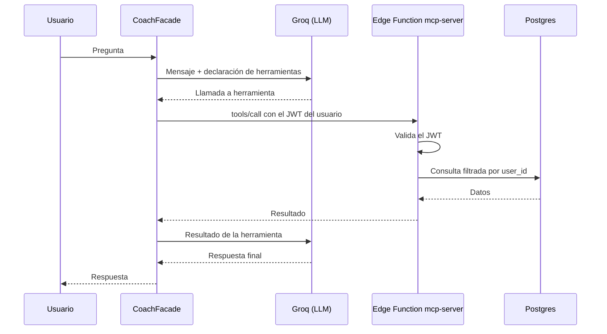

# App de Entrenamiento

**Registro de entrenamiento de fuerza para Android, con planificación por mesociclos y un coach IA que lee tu historial.**

[](https://github.com/Akxlarre/app-de-entrenamiento/actions/workflows/ci.yml)
[](https://github.com/Akxlarre/app-de-entrenamiento/actions/workflows/release.yml)


La app está pensada para usarse **entrenando**: pulso alto, una mano ocupada y veinte segundos entre series. Todo el diseño parte de esa restricción.

---

## Contenido

- [Funcionalidades](#funcionalidades)
- [Sistema visual Eclipse](#sistema-visual-eclipse)
- [Stack](#stack)
- [Arquitectura](#arquitectura)
- [Modelo de datos](#modelo-de-datos)
- [Puesta en marcha](#puesta-en-marcha)
- [Scripts](#scripts)
- [Calidad y tests](#calidad-y-tests)
- [Build de Android y releases](#build-de-android-y-releases)
- [Flujo de trabajo](#flujo-de-trabajo)

---

## Funcionalidades

| Área | Qué hace |
|---|---|
| **Sesión activa** | Registro serie a serie con peso, repeticiones, RIR y RPE. Tipos de serie (normal, calentamiento, dropset, al fallo), cronómetro de sesión y temporizador de descanso. La sesión en curso sobrevive a cierres de la app. |
| **Guardado tolerante a fallos** | Si al terminar no hay conexión o la sesión de login expiró, el entrenamiento queda en cola local y se sincroniza después. |
| **Rutinas** | Plantillas con ejercicios ordenados, series objetivo, descanso sugerido y notas. Se puede entrenar desde una rutina o en modo libre. |
| **Plan (mesociclo)** | Planificación por semanas y días, con semanas de descarga y objetivos de progresión (peso, reps, RIR) por serie. |
| **Reporte post-sesión** | Energía, RPE de la sesión y satisfacción, más feedback por ejercicio (dolor, técnica, equipo, intensidad). |
| **Historial** | Sesiones pasadas con detalle completo de cada una. |
| **Catálogo** | 876 ejercicios en español, con imágenes, instrucciones y búsqueda por varias palabras. Filtrable por grupo muscular. |
| **Coach IA** | Chat que consulta y modifica tus datos reales mediante herramientas: analiza progresión, volumen por músculo y feedback, crea rutinas y arma mesociclos completos. |
| **Actualizaciones en la app** | Al abrir (o desde Perfil) la app busca una versión nueva, descarga el APK desde Supabase Storage y lanza el instalador. |

---

## Sistema visual Eclipse

Dirección de arte oscura y de alto contraste: tinta casi negra, carmesí como base ceremonial, ámbar y oro como fuego. Es **solo modo oscuro** por decisión de diseño.

| Token | Color | Uso |
|---|---|---|
| `--brand-ink` | `#0a0608` | Fondo base |
| `--brand-bone` | `#f5f0e6` | Texto principal |
| `--brand-crimson` | `#a50e22` | Superficies de ceremonia |
| `--brand-ember` | `#ff6a1a` | Marca y acciones (`--ds-brand`) |
| `--brand-gold` | `#ffc83d` | Logros y momentos destacados |

Tipografía en tres roles: **Anton** para impacto, **Oswald** para números y **Archivo** para texto.

### Tiers de intensidad

El presupuesto gráfico de una pantalla es inversamente proporcional a la atención que le queda al usuario. Cada vista declara su tier en el contenedor raíz y los componentes se adaptan solos:

| Tier | Clase | Contexto | Vistas |
|---|---|---|---|
| 1 · Ceremonia | `.tier-ceremonia` | Hay tiempo, se mira de frente | Resumen de sesión, inicio de rutina, mesociclo, login |
| 2 · Trabajo | `.tier-trabajo` | Atención parcial, se navega | Catálogo, historial, perfil, coach |
| 3 · Dato | `.tier-dato` | Pulso alto, se ejecuta | Sesión activa (solo esa) |

Los estados (éxito, error, aviso, info) se distinguen por **forma** —ícono, borde y posición—, no solo por color. Hay tokens de ergonomía para objetivos táctiles de 44 px (56 px en acciones críticas) y un piso de texto de 13 px. El movimiento respeta `prefers-reduced-motion`.

Detalle en [`docs/BRAND_GUIDELINES.md`](docs/BRAND_GUIDELINES.md) y [`src/styles/layout/_tiers.scss`](src/styles/layout/_tiers.scss).

---

## Stack

| Capa | Tecnología |
|---|---|
| Framework | Angular 20 (standalone, Signals, OnPush, control flow nativo) |
| UI móvil | Ionic 9 + Capacitor 8 (Android) |
| Componentes | PrimeNG 20 + componentes propios en `shared/` |
| Estilos | Tailwind CSS v4 mapeado a tokens SCSS |
| Animación | GSAP vía `GsapAnimationsService` |
| Íconos | Lucide |
| Backend | Supabase: Postgres con RLS, Auth, Storage y Edge Functions (Deno) |
| IA | Groq (`qwen/qwen3.8-27b`) con function calling sobre un servidor MCP propio |
| Tests | Vitest + `@analogjs/vitest-angular` |

---

## Arquitectura

```text
src/app/
├── core/        Facades, servicios, repositorios, guards, modelos
├── features/    Páginas enrutables (smart components)
├── shared/      Componentes presentacionales (dumb components)
└── layout/      Shell con navegación por tabs
src/styles/
├── tokens/      Design tokens (fuente única de color, tipografía, motion)
├── layout/      Tiers, bento grid, page shell
└── vendors/     Overrides de PrimeNG e Ionic
supabase/
├── migrations/  Esquema versionado (SQL idempotente)
└── functions/   Edge Function mcp-server
```

### Patrón Facade

La UI nunca habla con Supabase directamente. Cada dominio tiene un facade (`WorkoutFacade`, `RoutineFacade`, `MesocycleFacade`, `ExerciseFacade`, `AuthFacade`, `AppUpdateFacade`) que centraliza el estado con Signals y lo expone a los templates.

### Coach IA



La Edge Function valida el token en cada llamada y filtra todo por el usuario autenticado. Herramientas disponibles:

`obtener_mis_rutinas` · `obtener_mis_entrenamientos_recientes` · `obtener_series_de_entrenamiento` · `obtener_entrenamiento_en_curso` · `buscar_ejercicios` · `analizar_progresion_ejercicio` · `analizar_volumen_muscular` · `analizar_historial_feedback` · `crear_rutina` · `eliminar_rutina` · `crear_mesociclo_completo`

---

## Modelo de datos

Todas las tablas tienen RLS: cada usuario solo ve y modifica lo suyo. El catálogo `exercises` es de solo lectura.

| Tabla | Propósito |
|---|---|
| `exercises` | Catálogo maestro (nombre en/es, músculo, equipamiento, categoría, instrucciones, imagen) |
| `routines` · `routine_exercises` | Plantillas y sus ejercicios, con series objetivo en `jsonb` |
| `workouts` · `workout_sets` | Sesiones y cada serie registrada (peso, reps, RIR, RPE, tipo) |
| `mesocycles` · `mesocycle_weeks` · `mesocycle_sessions` · `mesocycle_session_targets` | Plan periodizado y objetivos de progresión |
| `workout_reports` · `workout_exercise_feedback` | Feedback general y por ejercicio |
| `app_updates` | Versiones publicadas del APK |

Una rutina usada por un plan no se puede borrar (`ON DELETE RESTRICT`); primero hay que borrar el plan. El esquema completo está en [`supabase/migrations/`](supabase/migrations/).

---

## Puesta en marcha

### Requisitos

- Node.js 22
- Docker (para Supabase local)
- Supabase CLI (`npx supabase` sirve)
- Android Studio y JDK 21, solo para compilar el APK

### Pasos

1. Clonar e instalar dependencias:

   ```bash
   git clone https://github.com/Akxlarre/app-de-entrenamiento.git
   ```

   ```bash
   cd app-de-entrenamiento
   ```

   ```bash
   npm install --legacy-peer-deps
   ```

2. Levantar Supabase local. Aplica las migraciones y carga el catálogo de ejercicios:

   ```bash
   npm run supabase:start
   ```

   | Servicio | URL |
   |---|---|
   | API | `http://localhost:54351` |
   | Studio | `http://localhost:54353` |
   | Postgres | `localhost:54352` |

3. Configurar la anon key. `src/environments/environment.ts` ya apunta a `http://localhost:54351`; falta copiar ahí la `anon key` que imprime `supabase start`.

4. Configurar el coach IA (opcional). Crear un `.env` en la raíz:

   ```dotenv
   GEMINI_API_KEY=tu_api_key_de_groq
   ```

   > La variable se llama `GEMINI_API_KEY` por herencia, pero el coach usa **Groq**. Sin ella el resto de la app funciona igual.

5. Levantar la app en `http://localhost:4200`:

   ```bash
   npm start
   ```

   `npm start` inyecta la key del `.env` en `environment.ts` y arranca `ng serve` con el monitor de errores. `npm run start:raw` hace lo mismo sin el monitor.

> **Cuidado:** `set-local-env.js` escribe la key real en `environment.ts`, que está versionado. No commitear ese archivo con la key puesta.

---

## Scripts

| Script | Qué hace |
|---|---|
| `npm start` | Servidor de desarrollo con inyección de `.env` y monitor de errores |
| `npm run build` | Build de producción |
| `npm run test:ci` | Tests una vez, sin watch |
| `npm run test:watch` | Tests en modo watch |
| `npm run test:coverage` | Tests con cobertura |
| `npm run lint:arch` | Auditoría de reglas de arquitectura |
| `npm run supabase:start` / `supabase:stop` | Levanta o detiene Supabase local |
| `npm run supabase:reset` | Recrea la base desde las migraciones |
| `npm run supabase:types` | Regenera los tipos TypeScript del esquema |

---

## Calidad y tests

- **Tests unitarios** con Vitest para facades, servicios y páginas.
- **Lint arquitectónico** (`npm run lint:arch`, sobre el AST de TypeScript): exige OnPush en todos los componentes y un `.spec.ts` por cada facade y servicio de `core/`; prohíbe imports de Supabase o inyección de servicios en la UI (solo facades), `*ngIf`/`*ngFor`/`ngClass`/`ngStyle`, `@angular/animations`, `@keyframes` en componentes y colores Tailwind hardcodeados.
- **CI** en cada push y PR a `main`: lint arquitectónico, tests y build.

---

## Build de Android y releases

El workflow [`release.yml`](.github/workflows/release.yml) se dispara al publicar una release, al empujar un tag `v*` o manualmente:

1. Inyecta las credenciales de producción en `environment.prod.ts`
2. Compila Angular y sincroniza Capacitor
3. Compila el APK con Gradle; el `versionCode` es el número de ejecución del workflow
4. Firma el APK con el keystore de los secrets
5. Sube el APK a Supabase Storage y registra la versión en `app_updates`

Las instalaciones existentes detectan la nueva versión y ofrecen actualizar desde la propia app.

Para publicar una versión:

```bash
git tag v1.2.0
```

```bash
git push origin v1.2.0
```

### Secrets requeridos

| Secret | Uso |
|---|---|
| `SUPABASE_URL` | URL del proyecto de producción |
| `SUPABASE_ANON_KEY` | Key pública para el build |
| `SUPABASE_SERVICE_ROLE_KEY` | Subir el APK y registrar la versión |
| `GEMINI_API_KEY` | Key de Groq para el coach IA |
| `ANDROID_KEYSTORE_BASE64` | Keystore de firma en base64 |
| `ANDROID_KEY_ALIAS` | Alias de la key |
| `ANDROID_KEY_PASSWORD` | Contraseña del keystore y de la key |

Si falta el keystore, el workflow genera uno temporal para no cortar el despliegue. Un APK firmado con otra key no se instala encima del anterior, así que conviene tener siempre el keystore real configurado.

---

## Flujo de trabajo

- **Ramas:** `feature/*`, `fix/*`, `refactor/*` y `chore/*` desde `main`, que solo recibe cambios por PR.
- **Commits:** [Conventional Commits](https://www.conventionalcommits.org/) con scope, por ejemplo `feat(sesion-activa): …`.
- **Spec-Driven Development:** cada cambio de producto tiene un track en [`specs/`](specs/). Una feature nueva lleva `spec.md` con criterios de aceptación y un `plan.md`; un bug lleva `fix.md`. El track se cierra cuando todos los criterios están verificados.

Documentación complementaria:

- [`docs/TECH-STACK-RULES.md`](docs/TECH-STACK-RULES.md): reglas del stack
- [`docs/BRAND_GUIDELINES.md`](docs/BRAND_GUIDELINES.md): tokens, superficies y theming
- [`docs/HOOKS-SYSTEM.md`](docs/HOOKS-SYSTEM.md): guardrails del agente de desarrollo
